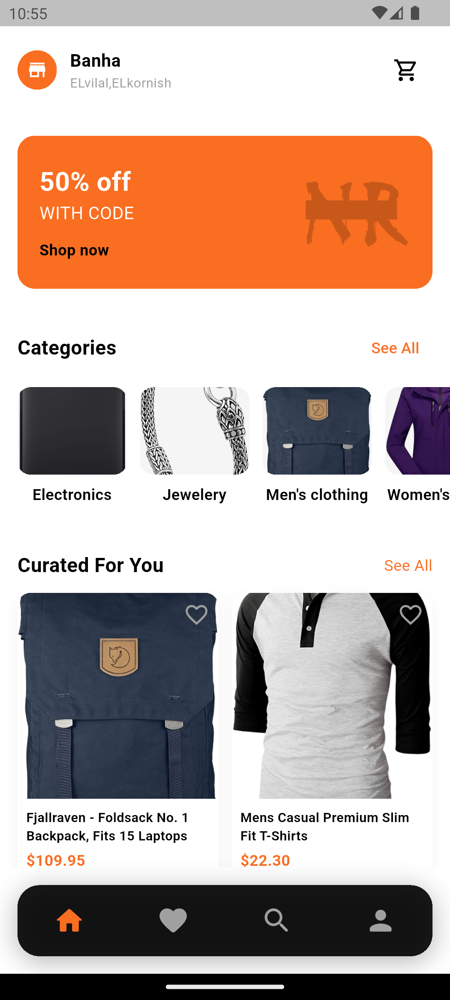
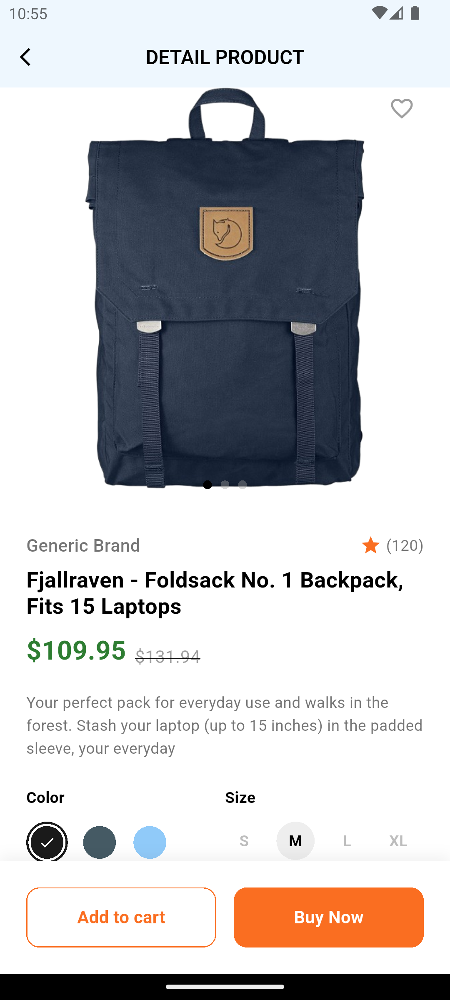
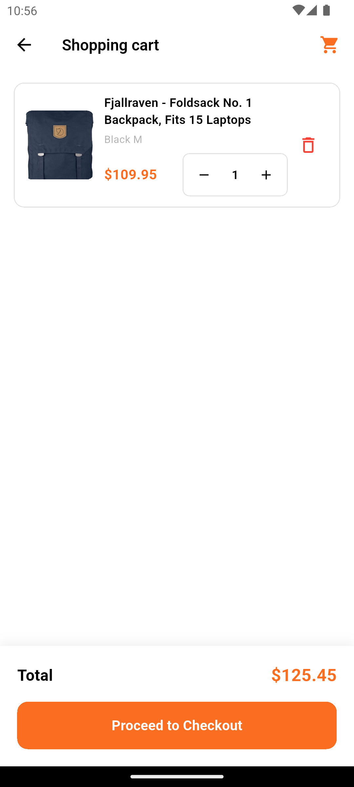

# 🛍️ Modern E-Commerce App

> A premium, feature-rich e-commerce mobile application built with Flutter & Riverpod.


---

## 📱 App Preview

<div align="center">
  
  
  
  
</div>

### ☀️ Light Theme

<div align="center">
  
  
  
  
</div>

### 🌙 Dark Theme

<div align="center">
  
  
  
  
</div>

---

## ✨ Key Features

### 🎨 Design & UX
- **Modern UI/UX**: Sleek design with smooth animations using `animate_do`.
- **Dark & Light Mode**: Fully supported dynamic theming with persistence using `shared_preferences`.
- **Responsive Layout**: Adapts gracefully to different screen sizes.

### 🔐 Authentication
- **Secure Flow**: Login, Sign Up, and Forgot Password screens.
- **Visual Feedback**: Interactive input fields and validation.

### 🛍️ Shopping Experience
- **Product Discovery**: Browse by categories or search products.
- **Detailed Views**: Product images carousel, size/color selection, and descriptions.
- **Smart Cart**: Add/remove items with real-time total calculation.
- **Wishlist**: Save your favorite items for later.

### 👤 User Profile
- **Dashboard**: View points, gift cards, and review stats.
- **Settings**: Manage account details, notifications, and app preferences.

---

## 🛠️ Tech Stack

This project relies on a robust stack of Flutter packages:

- **State Management**: [`flutter_riverpod`](https://pub.dev/packages/flutter_riverpod) - scalable and testable state.
- **Networking**: [`dio`](https://pub.dev/packages/dio) - powerful HTTP client.
- **Storage**: [`shared_preferences`](https://pub.dev/packages/shared_preferences) - persist user settings (like Theme).
- **Images**: [`cached_network_image`](https://pub.dev/packages/cached_network_image) - efficient image loading and caching.
- **UI Utilities**: 
  - [`flutter_svg`](https://pub.dev/packages/flutter_svg) & `cupertino_icons`
  - [`smooth_page_indicator`](https://pub.dev/packages/smooth_page_indicator)
  - [`animate_do`](https://pub.dev/packages/animate_do)

---

## 🚀 Getting Started

1.  **Clone the repository**
    ```bash
    git clone https://github.com/Mostafa-Hani19/ecommerce-app.git
    ```

2.  **Install dependencies**
    ```bash
    cd ecommerce
    flutter pub get
    ```

3.  **Run the app**
    ```bash
    flutter run
    ```

---

## 🤝 Contributing

Contributions are welcome! Please feel free to submit a Pull Request.